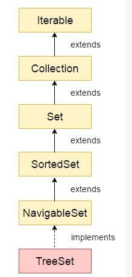

## Introduction ##
Java TreeSet class implements the Set interface that uses a tree for storage. It inherits AbstractSet class and implements the NavigableSet interface. 
The objects of the TreeSet class are stored in ascending order.

The important points about Java TreeSet class are:

- Java TreeSet class contains unique elements only like HashSet.
- Java TreeSet class access and retrieval times are quiet fast.
- Java TreeSet class doesn't allow null element.
- Java TreeSet class is non synchronized.
- Java TreeSet class maintains ascending order.

## Hierarchy of TreeSet class ##


Java TreeSet class implements the NavigableSet interface. The NavigableSet interface extends SortedSet, Set, Collection and Iterable interfaces in hierarchical order


## TreeSet class declaration ##

```java
public class TreeSet<E> extends AbstractSet<E> implements NavigableSet<E>, Cloneable, Serializable  
```

