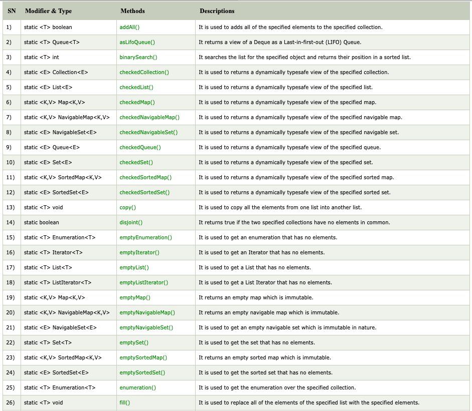
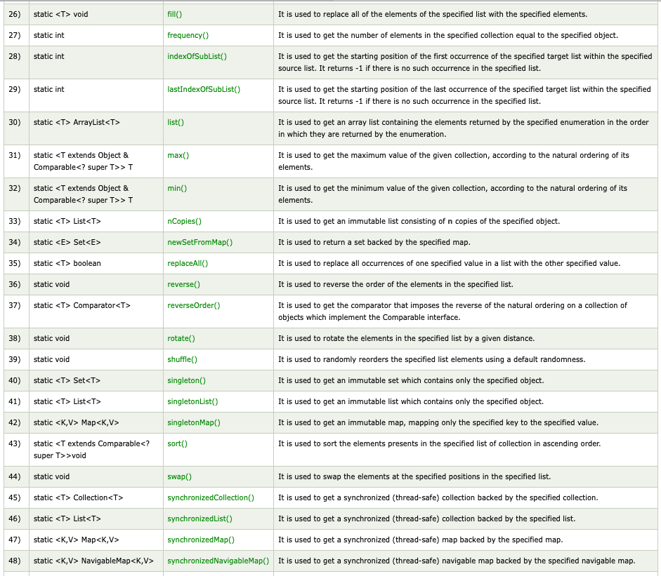

## What is collections class in Java ? ##
- Java collections class is used exclusively with static methods that operate on or return collections. 
It inherits Object class.
  
The important points about Java Collections class are:
- Java Collection class supports the polymorphic algorithms that operate on collections.
- Java Collection class throws a NullPointerException if the collections or class objects provided to them are null.




## Example ###
### Example 1 ###
- Finding max value from List
```java
mport java.util.*;  
public class CollectionsExample {  
    public static void main(String a[]){         
        List<Integer> list = new ArrayList<Integer>();  
        list.add(46);  
        list.add(67);  
        list.add(24);  
        list.add(16);  
        list.add(8);  
        list.add(12);  
        System.out.println("Value of maximum element from the collection: "+Collections.max(list));  
    }  
}  
```

- Finding min value from List
```java
import java.util.*;  
public class CollectionsExample {  
    public static void main(String a[]){         
        List<Integer> list = new ArrayList<Integer>();  
        list.add(46);  
        list.add(67);  
        list.add(24);  
        list.add(16);  
        list.add(8);  
        list.add(12);  
        System.out.println("Value of minimum element from the collection: "+Collections.min(list));  
    }  
}  
```