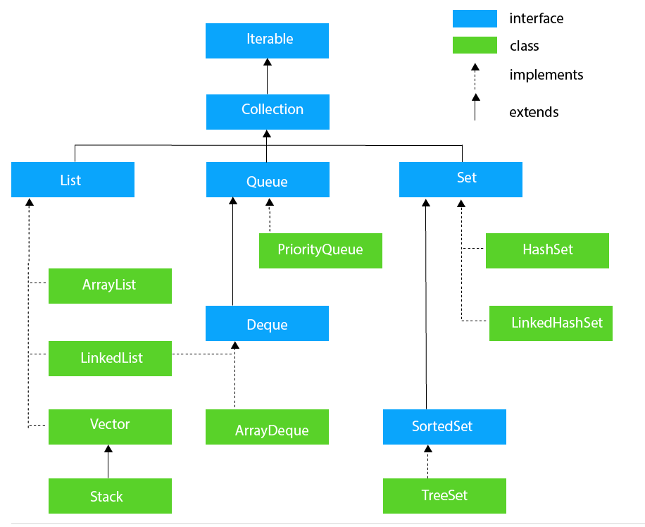
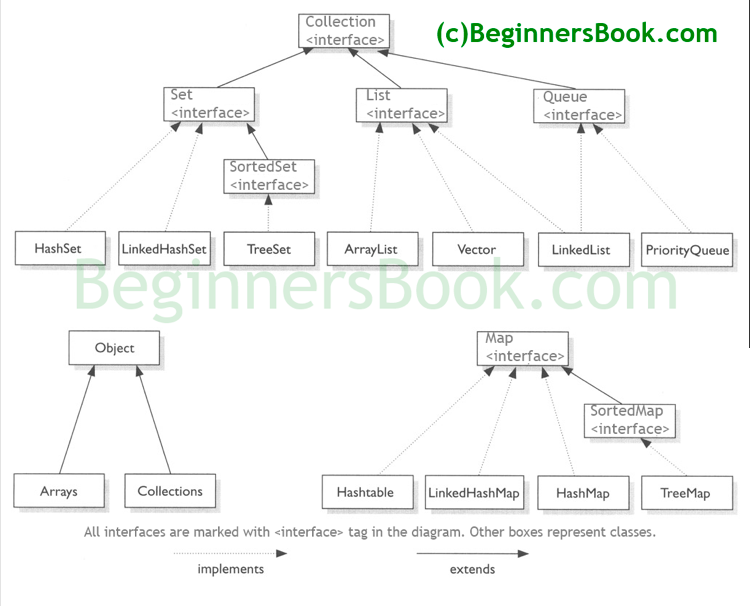
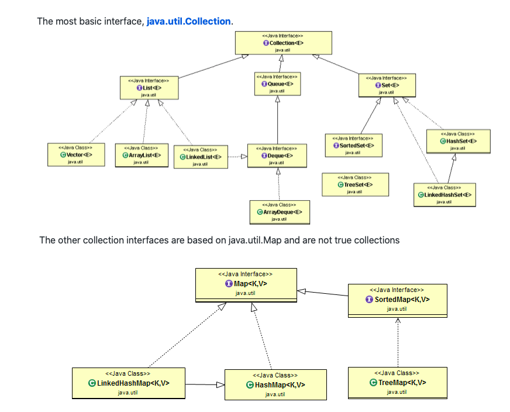

## Introduction about collection framework ##


The Collection interface is the root interface of the Java collections framework. There is no direct implementation of this interface. However, it is implemented through its subinterfaces like List, Set, and Queue.

Note: Interface extends another interface.





## Available method in collection interface ##
### Checking how many elements are in collection
```java
size
isEmpty
```

### Checking whether a given object is in collection or not ###
```java
contains 
```

### Add and remove an element from the collection ### 
```java
(add, remove)
```

### Provide an iterator over the collection ###
```java
(iterator)
```

### Methods that work on entire collection ###
```java
containsAll, addAll, removeAll, retainAll, clear.
```

### Bridge between collection and older APIs ###
```java
toArray 
```
