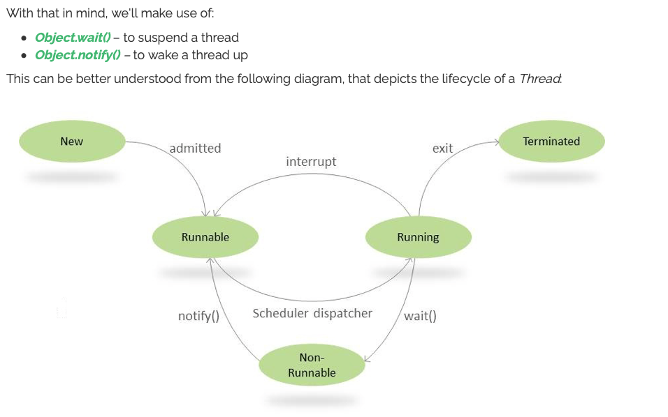
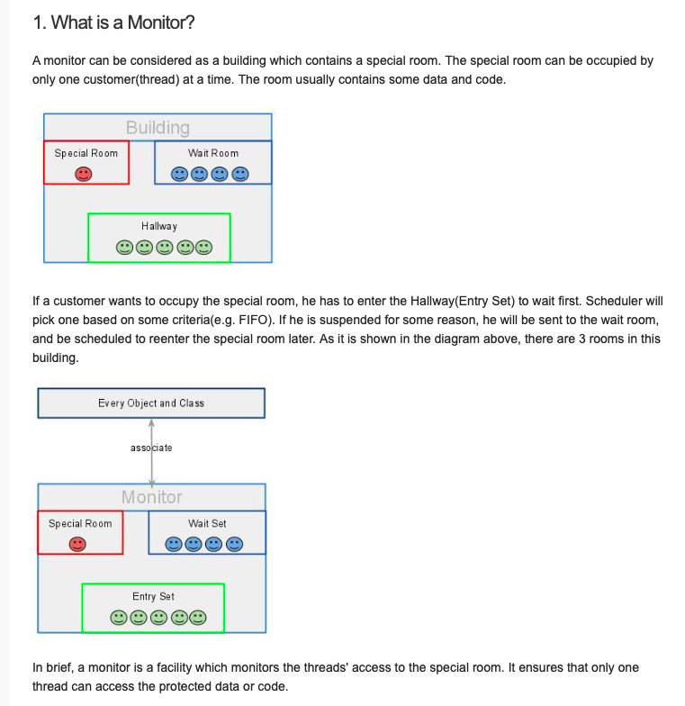
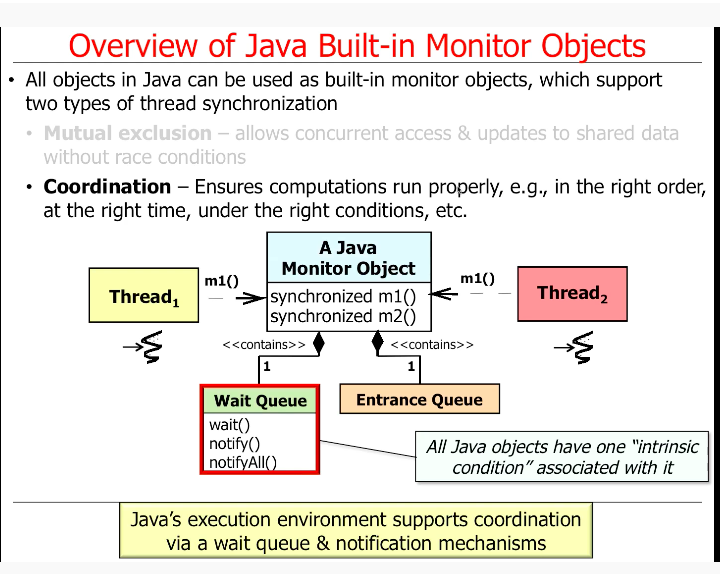

## Thread communication ##

### How wait() and notify method work in Java ###

#### How to work with wait() method ? ####
When we call wait() method – this forces the current thread to wait until some other thread invokes notify() or notifyAll() on the same object.

## What is monitors in Java thread ? ##

### Java Built in monitor object ###
 
