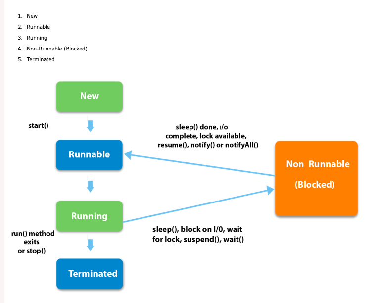

## Multi-threading in Java ##

### Possible ways of creating mult-threading application in Java ###
1. A thread can be created by implementing runnable interface and overriding it's run method
```java
public class A implements Runnable {

@override 
public void run(){

}

}
```

- To execute the run method by a thread, pass an instance of A to a thread inside constructor.
```java
Thread t1=new Thread(new A());
t1.start();
```

2. Extending thread class 
The second way of creating thread is to extends Thread and override it's run method and then create an instance of that class.
```java
public class MyClass extends Thread{
    public void run(){
      System.out.println("A");
      }
  }
  ```
  
  ```java
  To create and start above thread
  MyClass myClass=new MyClass();
  myClass.start();
  ```
## Thread state in Java ##

